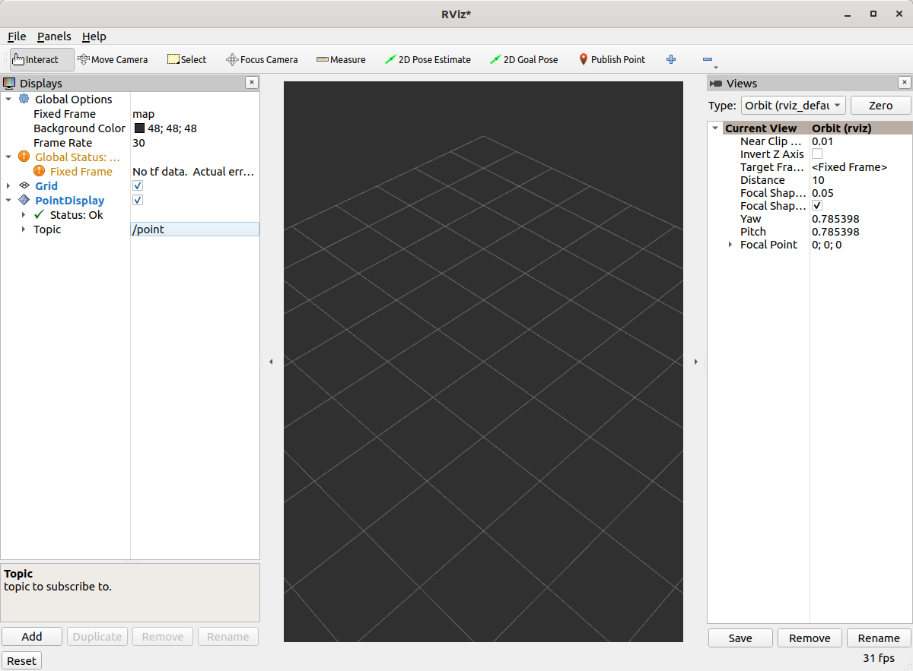

# rviz_plugin_tutorial
A tutorial on how to make rviz plugins

## Point2D Message
We'll be playing with a toy message defined in the [`rviz_plugin_tutorial_msgs`](rviz_plugin_tutorial_msgs) package: `Point2D.msg`:

```
std_msgs/Header header
float64 x
float64 y
```
## Boilerplate for Basic Plugin
Strap in, there's a lot of code. You can view the full version of this code with the branch name `step1`.

### Header File

Here are the contents of [`point_display.hpp`](rviz_plugin_tutorial/include/rviz_plugin_tutorial/point_display.hpp)

```c++

#pragma once

#include <rviz_common/message_filter_display.hpp>
#include <rviz_plugin_tutorial_msgs/msg/point2_d.hpp>

namespace rviz_plugin_tutorial
{
class PointDisplay : public rviz_common::MessageFilterDisplay<rviz_plugin_tutorial_msgs::msg::Point2D>
{
  Q_OBJECT

protected:
  void processMessage(const rviz_plugin_tutorial_msgs::msg::Point2D::ConstSharedPtr msg) override;
};
}  // namespace rviz_plugin_tutorial
```

 * We're implementing the [`MessageFilterDisplay`](https://github.com/ros2/rviz/blob/0ef2b56373b98b5536f0f817c11dc2b5549f391d/rviz_common/include/rviz_common/message_filter_display.hpp#L43) class which can be used with any message with a `std_msgs/Header`.
 * The class is templated with our `Point2D` message type.
 * For reasons outside the scope of this tutorial, you need the `Q_OBJECT` macro in there to get the QT parts of the gui to work.
 * `processMessage` is the only method that needs to be implemented, which we'll do the cpp file.

### Source File
[`point_display.cpp`](rviz_plugin_tutorial/src/point_display.cpp)

```c++
#include <rviz_plugin_tutorial/point_display.hpp>
#include <rviz_common/logging.hpp>

namespace rviz_plugin_tutorial
{
void PointDisplay::processMessage(const rviz_plugin_tutorial_msgs::msg::Point2D::ConstSharedPtr msg)
{
  RVIZ_COMMON_LOG_INFO_STREAM("We got a message with frame " << msg->header.frame_id);
}
}  // namespace rviz_plugin_tutorial

#include <pluginlib/class_list_macros.hpp>
PLUGINLIB_EXPORT_CLASS(rviz_plugin_tutorial::PointDisplay, rviz_common::Display)
```

 * The logging is not strictly necessary.
 * In order for RViz to find our plugin, we need this `PLUGINLIB` invocation in our code (as well as other things below)

### package.xml
We need the following three dependencies in our package.xml:
```xml
  <depend>pluginlib</depend>
  <depend>rviz_common</depend>
  <depend>rviz_plugin_tutorial_msgs</depend>
```

### rviz_common_plugins.xml
```xml
<library path="point_display">
  <class type="rviz_plugin_tutorial::PointDisplay" base_class_type="rviz_common::Display">
    <description></description>
  </class>
</library>
```
 * This is standard `pluginlib` code.
  * The library `path` is the name of the library we'll assign in the CMake.
  * The class should match the `PLUGINLIB` invocation from above.
 * We'll come back to the description later, I promise.

### CMakeLists.txt
Everyone loves how verbose CMake files are in ROS 2! The following lines are on top of the standard boilerplate.

```cmake
find_package(ament_cmake_ros REQUIRED)
find_package(pluginlib REQUIRED)
find_package(rviz_common REQUIRED)
find_package(rviz_plugin_tutorial_msgs REQUIRED)

set(CMAKE_AUTOMOC ON)
qt5_wrap_cpp(MOC_FILES
  include/rviz_plugin_tutorial/point_display.hpp
)

add_library(point_display src/point_display.cpp ${MOC_FILES})
target_include_directories(point_display PUBLIC
  $<BUILD_INTERFACE:${CMAKE_CURRENT_SOURCE_DIR}/include>
  $<INSTALL_INTERFACE:include>
)
ament_target_dependencies(point_display
  pluginlib
  rviz_common
  rviz_plugin_tutorial_msgs
)
install(TARGETS point_display
        EXPORT export_rviz_plugin_tutorial
        ARCHIVE DESTINATION lib
        LIBRARY DESTINATION lib
        RUNTIME DESTINATION bin
)
install(DIRECTORY include/
        DESTINATION include
)
install(FILES rviz_common_plugins.xml
        DESTINATION share/${PROJECT_NAME}
)
ament_export_include_directories(include)
ament_export_targets(export_rviz_plugin_tutorial)
pluginlib_export_plugin_description_file(rviz_common rviz_common_plugins.xml)
```

 * To generate the proper QT files, we need to
  A) Turn `CMAKE_AUTOMOC` on
  B) Wrap the headers by calling `qt5_wrap_cpp` with each header that has `Q_OBJECT` in it.
  C) Include the `MOC_FILES` in the library alongside our other cpp files.
 * Note that if you do NOT wrap your header files, you may get an error message when attempting to load the plugin at runtime, along the lines of:
   ```
   [rviz2]: PluginlibFactory: The plugin for class 'rviz_plugin_tutorial::PointDisplay' failed to load. Error: Failed to load library /home/ros/ros2_ws/install/rviz_plugin_tutorial/lib/libpoint_display.so. Make sure that you are calling the PLUGINLIB_EXPORT_CLASS macro in the library code, and that names are consistent between this macro and your XML. Error string: Could not load library LoadLibrary error: /home/ros/ros2_ws/install/rviz_plugin_tutorial/lib/libpoint_display.so: undefined symbol: _ZTVN20rviz_plugin_tutorial12PointDisplayE, at /tmp/binarydeb/ros-foxy-rcutils-1.1.4/src/shared_library.c:84
   ```
 * A lot of the other code ensures that the plugin portion works. Namely, calling `pluginlib_export_plugin_description_file` is essential to getting RViz to find your new plugin.

### Testing it out
Compile your code and run `rviz2`. You should be able to add your new plugin by clicking `Add` in the bottom left, and then selecting your package/plugin.


Initially, the display will be in an error state because you have yet to assign a topic.


Let's put the topic `/point` and it should load fine, although not display anything.


You can publish messages with the following command:
```bash
ros2 topic pub /point rviz_plugin_tutorial_msgs/msg/Point2D "{header: {frame_id: map}, x: 1, y: 2}" -r 0.5
```

That should result in the "We got a message" logging to appear in the `stdout` of RViz.
