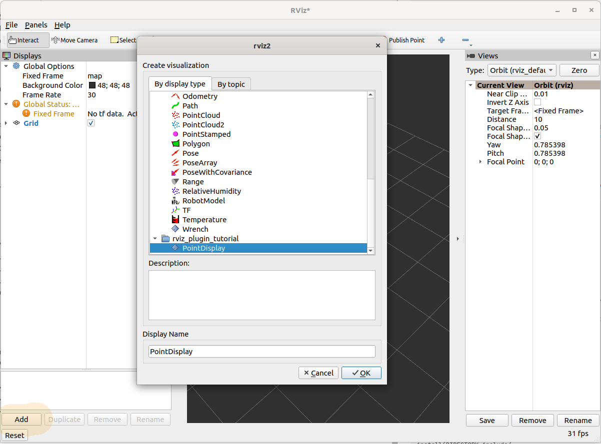
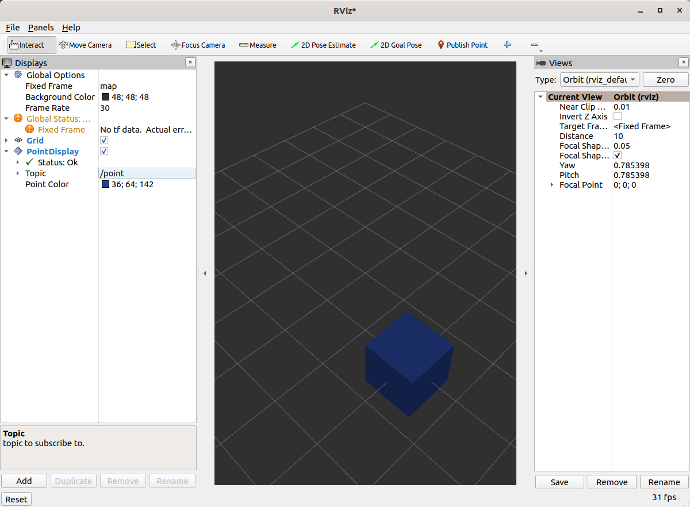
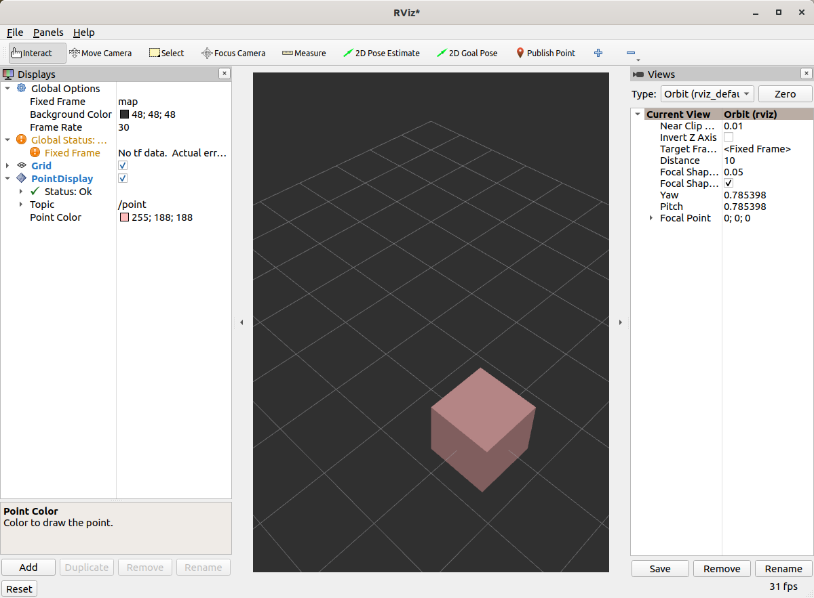
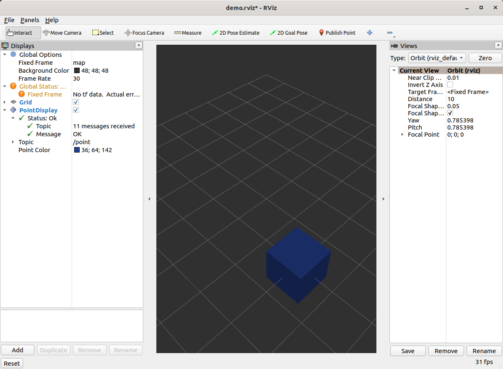
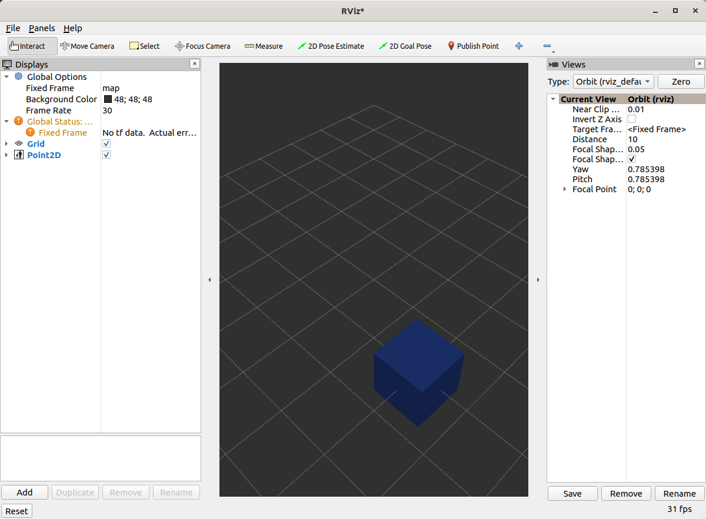

# Building a Custom RViz Display

## Background
There are many types of data that have existing visualizations in RViz. However, if there is a message type that does
not yet have a plugin to display it, there are two choices to see it in RViz.

 1. Convert the message to another type, such as `visualization_msgs/Marker`.
 2. Write a Custom RViz Display.

With the first option, there is more network traffic and limitations to how the data can be represented. It is also quick and flexible.
The latter option is explained in this tutorial. It takes a bit of work, but can lead to much richer visualizations.

All of the code for this tutorial can be found in `this repository <https://github.com/MetroRobots/rviz_plugin_tutorial>`__.
In order to see the incremental progress of the plugin written in this tutorial,
the repository has different branches (`step2`, `step3`...) that can each be compiled and run as you go.


## Point2D Message
We'll be playing with a toy message defined in the [`rviz_plugin_tutorial_msgs`](rviz_plugin_tutorial_msgs) package: `Point2D.msg`:

```
std_msgs/Header header
float64 x
float64 y
```
## Boilerplate for Basic Plugin
Strap in, there's a lot of code. You can view the full version of this code with the branch name `step1`.

### Header File

Here are the contents of [`point_display.hpp`](rviz_plugin_tutorial/include/rviz_plugin_tutorial/point_display.hpp)

```c++

#ifndef RVIZ_PLUGIN_TUTORIAL__POINT_DISPLAY_HPP_
#define RVIZ_PLUGIN_TUTORIAL__POINT_DISPLAY_HPP_

#include <rviz_common/message_filter_display.hpp>
#include <rviz_plugin_tutorial_msgs/msg/point2_d.hpp>

namespace rviz_plugin_tutorial
{
class PointDisplay
  : public rviz_common::MessageFilterDisplay<rviz_plugin_tutorial_msgs::msg::Point2D>
{
  Q_OBJECT

protected:
  void processMessage(const rviz_plugin_tutorial_msgs::msg::Point2D::ConstSharedPtr msg) override;
};
}  // namespace rviz_plugin_tutorial

#endif  // RVIZ_PLUGIN_TUTORIAL__POINT_DISPLAY_HPP_
```

 * We're implementing the [`MessageFilterDisplay`](https://github.com/ros2/rviz/blob/0ef2b56373b98b5536f0f817c11dc2b5549f391d/rviz_common/include/rviz_common/message_filter_display.hpp#L43) class which can be used with any message with a `std_msgs/Header`.
 * The class is templated with our `Point2D` message type.
 * [For reasons outside the scope of this tutorial](https://doc.qt.io/archives/qt-4.8/moc.html), you need the `Q_OBJECT` macro in there to get the QT parts of the gui to work.
 * `processMessage` is the only method that needs to be implemented, which we'll do in the cpp file.

### Source File
[`point_display.cpp`](rviz_plugin_tutorial/src/point_display.cpp)

```c++
#include <rviz_plugin_tutorial/point_display.hpp>
#include <rviz_common/logging.hpp>

namespace rviz_plugin_tutorial
{
void PointDisplay::processMessage(const rviz_plugin_tutorial_msgs::msg::Point2D::ConstSharedPtr msg)
{
  RVIZ_COMMON_LOG_INFO_STREAM("We got a message with frame " << msg->header.frame_id);
}
}  // namespace rviz_plugin_tutorial

#include <pluginlib/class_list_macros.hpp>
PLUGINLIB_EXPORT_CLASS(rviz_plugin_tutorial::PointDisplay, rviz_common::Display)
```

 * The logging is not strictly necessary, but helps with debugging.
 * In order for RViz to find our plugin, we need this `PLUGINLIB` invocation in our code (as well as other things below)

### package.xml
We need the following three dependencies in our package.xml:
```xml
  <depend>pluginlib</depend>
  <depend>rviz_common</depend>
  <depend>rviz_plugin_tutorial_msgs</depend>
```

### rviz_common_plugins.xml
```xml
<library path="point_display">
  <class type="rviz_plugin_tutorial::PointDisplay" base_class_type="rviz_common::Display">
    <description></description>
  </class>
</library>
```
 * This is standard `pluginlib` code.
  * The library `path` is the name of the library we'll assign in the CMake.
  * The class should match the `PLUGINLIB` invocation from above.
 * We'll come back to the description later, I promise.

### CMakeLists.txt
Add the following lines to the top of the standard boilerplate.

```cmake
find_package(ament_cmake_ros REQUIRED)
find_package(pluginlib REQUIRED)
find_package(rviz_common REQUIRED)
find_package(rviz_plugin_tutorial_msgs REQUIRED)

set(CMAKE_AUTOMOC ON)
qt5_wrap_cpp(MOC_FILES
  include/rviz_plugin_tutorial/point_display.hpp
)

add_library(point_display src/point_display.cpp ${MOC_FILES})
target_include_directories(point_display PUBLIC
  $<BUILD_INTERFACE:${CMAKE_CURRENT_SOURCE_DIR}/include>
  $<INSTALL_INTERFACE:include>
)
ament_target_dependencies(point_display
  pluginlib
  rviz_common
  rviz_plugin_tutorial_msgs
)
install(TARGETS point_display
        EXPORT export_rviz_plugin_tutorial
        ARCHIVE DESTINATION lib
        LIBRARY DESTINATION lib
        RUNTIME DESTINATION bin
)
install(DIRECTORY include/
        DESTINATION include
)
install(FILES rviz_common_plugins.xml
        DESTINATION share/${PROJECT_NAME}
)
ament_export_include_directories(include)
ament_export_targets(export_rviz_plugin_tutorial)
pluginlib_export_plugin_description_file(rviz_common rviz_common_plugins.xml)
```

 * To generate the proper Qt files, we need to
  A) Turn `CMAKE_AUTOMOC` on
  B) Wrap the headers by calling `qt5_wrap_cpp` with each header that has `Q_OBJECT` in it.
  C) Include the `MOC_FILES` in the library alongside our other cpp files.
 * Note that if you do NOT wrap your header files, you may get an error message when attempting to load the plugin at runtime, along the lines of:
   ```
   [rviz2]: PluginlibFactory: The plugin for class 'rviz_plugin_tutorial::PointDisplay' failed to load. Error: Failed to load library /home/ros/ros2_ws/install/rviz_plugin_tutorial/lib/libpoint_display.so. Make sure that you are calling the PLUGINLIB_EXPORT_CLASS macro in the library code, and that names are consistent between this macro and your XML. Error string: Could not load library LoadLibrary error: /home/ros/ros2_ws/install/rviz_plugin_tutorial/lib/libpoint_display.so: undefined symbol: _ZTVN20rviz_plugin_tutorial12PointDisplayE, at /tmp/binarydeb/ros-foxy-rcutils-1.1.4/src/shared_library.c:84
   ```
 * A lot of the other code ensures that the plugin portion works. Namely, calling `pluginlib_export_plugin_description_file` is essential to getting RViz to find your new plugin.

### How to build the plugin
The plugin is built like any ROS2 package.
First, you need a ROS2 installation.
At the time of writing, the most recent release is `kilted`.
You can build ROS2 source by following [this tutorial](https://docs.ros.org/en/kilted/Installation/Alternatives/Ubuntu-Development-Setup.html) for Ubuntu 24.
If you follow the defaults, you will end up with a directory called `~/ros2_kilted` containing all the ROS2 source and binaries.

You should build `rviz_plugin_tutorial` in an *overlay workspace*. That means creating a new folder, separate from `ros2_kilted`.
It's common to name this `ros2_ws` and create an `src` folder within:

```bash
$ mkdir ~/ros2_ws
$ cd ~/ros2_ws
$ mkdir src
```
Place your source code in `ros2_ws/src`:
```bash
$ cd ~/ros2_ws/src
$ git clone git@github.com/MetroRobots/rviz_plugin_tutorial
```
Now you use the `colcon` build tool to coordinate the cmake-driven compilation of `rviz_plugin_tutorial`:
```bash
$ colcon build --symlink-install
Starting >>> rviz_plugin_tutorial_msgs
Finished <<< rviz_plugin_tutorial_msgs [8.27s]
Starting >>> rviz_plugin_tutorial
Finished <<< rviz_plugin_tutorial [10.8s]

Summary: 2 packages finished [19.8s]
```
Before running `rviz2`, make sure that your plugin will be available by activating the `ros2_ws`:
```bash
$ source install/setup.bash
```
You can learn more about `colcon` and workspaces from [this tutorial](https://docs.ros.org/en/kilted/Tutorials/Beginner-Client-Libraries/Colcon-Tutorial.html).

### Testing it out
Once you've compiled your code (and activated the build) run `rviz2`. You should be able to add your new plugin by clicking `Add` in the bottom left, and then selecting your package/plugin.



Initially, the display will be in an error state because you have yet to assign a topic.


If we put the topic `/point` in, it should load fine but not display anything.


You can publish messages with the following command:
```bash
ros2 topic pub /point rviz_plugin_tutorial_msgs/msg/Point2D "{header: {frame_id: map}, x: 1, y: 2}" -r 0.5
```

That should result in the "We got a message" logging to appear in the `stdout` of RViz.

## Actual Visualization
You can view the full version of this step with the branch name `step2`.

First, you need to add a dependency in `CMakeLists.txt` and `package.xml` on the package `rviz_rendering`.

We need to add three lines to the header file:
 * `#include <rviz_rendering/objects/shape.hpp>` - There's [lots of options in the `rviz_rendering` package](https://github.com/ros2/rviz/tree/ros2/rviz_rendering/include/rviz_rendering/objects) for objects to build your visualization on. Here we're using a simple shape.
 * In the class, we'll add a new `protected` virtual method: `void onInitialize() override;`
 * We also add a pointer to our shape object: `std::unique_ptr<rviz_rendering::Shape> point_shape_;`

Then in the cpp file, we define the `onInitialize` method:
```c++
void PointDisplay::onInitialize()
{
  MFDClass::onInitialize();
  point_shape_ =
    std::make_unique<rviz_rendering::Shape>(rviz_rendering::Shape::Type::Cube, scene_manager_,
      scene_node_);
}
```
 * `MFDClass` is [aliased](https://github.com/ros2/rviz/blob/0ef2b56373b98b5536f0f817c11dc2b5549f391d/rviz_common/include/rviz_common/message_filter_display.hpp#L57) to the templated parent class for convenience.
 * The shape object must be constructed here in the `onInitialize` method rather than the constructor because otherwise `scene_manager_` and `scene_node_` would not be ready.

We also update our `processMessage` method:
```c++
void PointDisplay::processMessage(const rviz_plugin_tutorial_msgs::msg::Point2D::ConstSharedPtr msg)
{
  RVIZ_COMMON_LOG_INFO_STREAM("We got a message with frame " << msg->header.frame_id);

  Ogre::Vector3 position;
  Ogre::Quaternion orientation;
  if (!context_->getFrameManager()->getTransform(msg->header, position, orientation)) {
    RVIZ_COMMON_LOG_DEBUG_STREAM("Error transforming from frame '" << msg->header.frame_id <<
        "' to frame '" << qPrintable(fixed_frame_) << "'");
  }

  scene_node_->setPosition(position);
  scene_node_->setOrientation(orientation);

  Ogre::Vector3 point_pos;
  point_pos.x = msg->x;
  point_pos.y = msg->y;
  point_shape_->setPosition(point_pos);
}
```

 * We need to get the proper frame for our message and transform the `scene_node_` accordingly. This ensures that the visualization does not always appear relative to the fixed frame.
 * The actual visualization that we've been building up to is in the last four lines: we set the position of the visualization to match the message's position.

The result should look like this:


If the box does not appear in that location, it might be because:

 * You are not publishing the topic at this time
 * The message hasn't been published in the last 2 seconds.
 * You did not properly set the topic in RViz.

## It's Nice to Have Options.

If you want to allow users to customize different properties of the visualization, you need to add [`rviz_common::Property` objects](https://github.com/ros2/rviz/tree/ros2/rviz_common/include/rviz_common/properties).

You can view the full version of this step with the branch name `step3`.

### Header Updates
 * `#include <rviz_common/properties/color_property.hpp>` Color is but one of many properties you can set.
 * ```c++
   private Q_SLOTS:
     void updateStyle();
  ``` This gets called whenever the gui is changed, via Qt's SLOT/SIGNAL framework.
 * `std::unique_ptr<rviz_common::properties::ColorProperty> color_property_;` The property itself.

### Cpp Updates
 * `#include <rviz_common/properties/parse_color.hpp>` - Contains helper function to convert property to OGRE color.
 * To our `onInitialize` we add
   ```c++
    color_property_ = std::make_unique<rviz_common::properties::ColorProperty>(
        "Point Color", QColor(36, 64, 142), "Color to draw the point.", this, SLOT(updateStyle()));
    updateStyle();
   ```
    * This constructs the object with its name, default value, description and the callback.
    * We call `updateStyle` directly so that the color is set at the beginning even before the property is changed.
 * Then we define the callback.
   ```c++
    void PointDisplay::updateStyle()
    {
      Ogre::ColourValue color = rviz_common::properties::qtToOgre(color_property_->getColor());
      point_shape_->setColor(color);
    }
   ```

The result should look like this:


Ooh, pink!



## Status Report
You can view the full version of this step with the branch name `step4`.

You can also set the status of the display. As an arbitrary example, let's make our display show a warning when the x coordinate is negative, because why not? In `processMessage`:

```c++
  if (msg->x < 0) {
    setStatus(StatusProperty::Warn, "Message",
        "I will complain about points with negative x values.");
  } else {
    setStatus(StatusProperty::Ok, "Message", "OK");
  }
```

 * We're assuming a previous `using rviz_common::properties::StatusProperty;` declaration.
 * Think of the status as Key/Value pairs, with the key being some string (here we're using `"Message"`) and the values are the status level (error/warn/ok) and the description (some other string).





## Cleanup
Now its time to clean it up a bit. This makes things look nicer and be a little easier to use, but aren't strictly required. You can view the full version of this step with the branch name `step5`.

First, we update the plugin declaration.

```xml
<library path="point_display">
  <class name="Point2D" type="rviz_plugin_tutorial::PointDisplay" base_class_type="rviz_common::Display">
    <description>Tutorial to display a point</description>
    <message_type>rviz_plugin_tutorial_msgs/msg/Point2D</message_type>
  </class>
</library>
```
 * We add the `name` field to the `class` tag. This changes the name that is displayed in RViz. In code, it makes sense to call it a `PointDisplay` but in RViz, we want to simplify.
 * We put actual text into the description. Don't be lazy.
 * By declaring the specific message type here, when you attempt to add a Display by Topic, it will suggest this plugin for the topics of that type.

We also add an icon for the plugin at `icons/classes/Point2D.png`. The folder is hardcoded, and the filename should match the name from the plugin declaration (or the name of the class if not specified). [[icon source]](
https://commons.wikimedia.org/wiki/File:Free_software_icon.svg)

We need to install the image file in the CMake.
```cmake
install(FILES icons/classes/Point2D.png
        DESTINATION share/${PROJECT_NAME}/icons/classes
)
```

Now when you add the display, it should show up with an icon and description.


Here is the display when attempting to add by topic:


And finally, here's the icon in the standard interface:



Note, if you change the plugins name, previous RViz configurations will no longer work.
